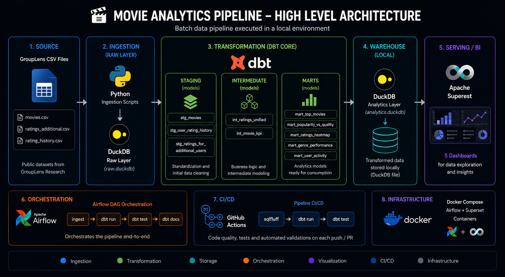
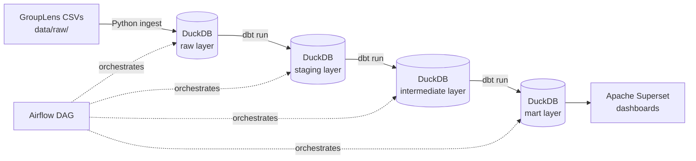
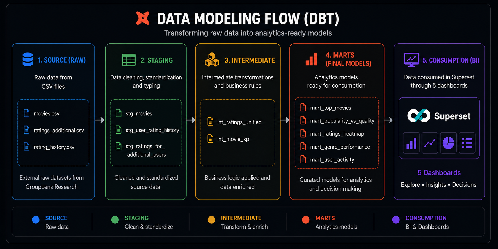
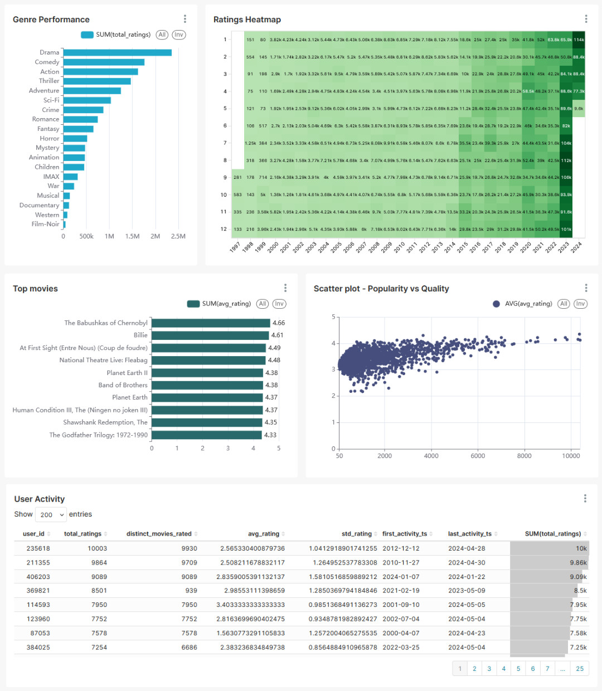

# Movie Recommendation Analytics Pipeline


End-to-end batch data pipeline using the public [GroupLens](https://grouplens.org/datasets/movielens/) movie recommendation dataset. Runs **100% locally** with open-source tools — no cloud account required.

---

## Architecture





| Layer | Tool | Role |
|---|---|---|
| Ingestion | Python + DuckDB | Load raw CSVs into local warehouse |
| Transformation | dbt Core | Staging, business logic, analytics marts |
| Orchestration | Apache Airflow | Schedule and monitor the full pipeline |
| Serving | Apache Superset | Interactive dashboards |
| CI/CD | GitHub Actions | `dbt test` + SQL lint on every push |

---

## Dataset

Source: [GroupLens Movie Recommendation Dataset](https://grouplens.org/datasets/movielens/)

Three CSV files are ingested into the pipeline:

| File | Description | Key columns |
|---|---|---|
| `movies.csv` | Movie catalog | `movieId`, `title`, `genres` |
| `ratings_for_additional_users.csv` | Explicit user ratings (additional cohort) | `userId`, `movieId`, `rating`, `timestamp` |
| `user_rating_history.csv` | Historical ratings per user (main cohort) | `userId`, `movieId`, `rating`, `timestamp` |

---

## Quick Start

**Prerequisites:** Python 3.11+, Docker + Docker Compose, dbt Core (`pip install dbt-duckdb`)

```bash
# 1. Clone and set up
git clone https://github.com/czelusniak/movie-analytics-pipeline.git
cd movie-analytics-pipeline
pip install -r ingestion/requirements.txt

# 2. Download GroupLens CSVs to data/raw/ (see Dataset section above)

# 3. Run the full pipeline
python ingestion/load_to_duckdb.py        # Load CSVs → DuckDB raw layer
cd dbt_project && dbt run --profiles-dir . --project-dir .    # Transform: staging → intermediate → mart
dbt test --profiles-dir . --project-dir .                     # Run all data quality tests
cd ..

# 4. Start services
docker compose -f airflow/docker-compose-airflow.yml up -d    # Airflow UI at http://localhost:8080
docker compose -f docker/docker-compose-superset.yml up -d    # Superset at http://localhost:8088
```

---

## Project Structure

```
movie-analytics-pipeline/
├── data/
│   ├── raw/                          # GroupLens CSVs (not committed)
│   ├── sample/                       # 100-row samples for CI testing
│   └── warehouse.duckdb              # Generated local warehouse (not committed)
├── ingestion/
│   ├── load_to_duckdb.py             # Loads CSVs into DuckDB raw layer
│   └── generate_samples.py           # Generates 100-row sample files for CI
├── dbt_project/
│   ├── dbt_project.yml
│   ├── profiles.yml
│   └── models/
│       ├── staging/                  # 1:1 with raw — type cast and rename only
│       ├── intermediate/             # Business logic and joins
│       ├── marts/                    # Analytics-ready, Superset-facing
│       └── exposures.yml             # Documents Superset as downstream consumer
├── airflow/
│   ├── dags/movie_pipeline_dag.py    # Orchestration DAG
│   └── docker-compose-airflow.yml
├── docker/
│   └── docker-compose-superset.yml
├── docs/
│   └── airflow-fluxo.md              # Airflow architecture deep-dive
├── .github/workflows/ci.yml          # CI: dbt test + sqlfluff
└── README.md
```

---

## dbt Layers



| Layer | Models | Purpose |
|---|---|---|
| staging | `stg_movies`, `stg_user_rating_history`, `stg_ratings_for_additional_users` | Type casting and renaming, 1:1 with raw |
| intermediate | `int_ratings_unified`, `int_movie_kpi` | UNION ALL of both rating sources; per-movie aggregated KPIs |
| marts | `mart_top_movies`, `mart_popularity_vs_quality`, `mart_ratings_heatmap`, `mart_genre_performance`, `mart_user_activity` | Analytics-ready, exposed to Superset |

---

## Dashboards (Superset)



| Dashboard | Business question answered |
|---|---|
| Top 10 Movies | Which movies have the highest avg rating with ≥20 ratings? |
| Popularity vs Quality | Is there a correlation between number of ratings and avg score? |
| Ratings Heatmap | Are there seasonal patterns in user rating behavior? |
| Genre Performance | Which genres have the most volume vs. best quality? |
| User Activity | What is the distribution of user engagement? |

A Superset export (dashboards + datasets) is available at [`docs/dashboard_export.zip`](docs/dashboard_export.zip) for local import.

---

## Data Quality

Tests implemented via dbt (`schema.yml`):

- `not_null` on all primary and foreign keys across all layers
- `unique` on `movie_id` in `stg_movies`
- `accepted_values` for `rating` column (0.5–5.0 scale) in `int_ratings_unified`
- `relationships` test: `int_ratings_unified.movie_id` → `stg_movies.movie_id` (severity: warn — ~10k orphan ratings kept by design)

```bash
cd dbt_project && dbt test --profiles-dir . --project-dir .
# All tests must pass before merging (enforced by CI)
```

---

## CI/CD

Every push triggers:

1. Sample data is copied to `data/raw/` (100-row CSVs from `data/sample/`)
2. `python ingestion/load_to_duckdb.py` loads the warehouse
3. `sqlfluff lint` checks SQL style consistency
4. `dbt run && dbt test` validates models and data quality

See [.github/workflows/ci.yml](.github/workflows/ci.yml).

---

## What I Built and Learned

**Problems solved:**
- Multi-value `genres` field (pipe-separated) normalized into a flat structure via `CROSS JOIN unnest(string_split(...))`
- Two rating source files with slightly different timestamp formats unified with `COALESCE(try_strptime(...), try_strptime(...))`
- User activity metrics aggregated with proper handling of NULL and single-rating users

**Skills demonstrated:**
- Medallion architecture (raw → staging → intermediate → mart)
- dbt: `ref()`, `source()`, generic tests, `schema.yml` as data contracts, `exposures.yml` for lineage
- Airflow: DAG authoring, `BashOperator`, task dependencies, 4-task pipeline (ingest → run → test → docs)
- Docker Compose: multi-service local environment (Airflow + Superset)
- GitHub Actions: automated data quality gates on every push

---

## Stack

| Tool | Version | Role |
|---|---|---|
| Python | 3.11 | Ingestion scripting |
| DuckDB | 0.10+ | Local analytical warehouse (replaces BigQuery) |
| dbt Core | 1.8+ | SQL transformations + testing |
| Apache Airflow | 2.9+ | Pipeline orchestration |
| Apache Superset | 4.x | Dashboards and data exploration |
| Docker Compose | v2 | Local service orchestration |
| GitHub Actions | — | CI/CD |

---

## Inspiration

This project was inspired by [vbluuiza](https://github.com/vbluuiza)'s [Data Engineering tutorial](https://www.youtube.com/watch?v=38FhOVq3tI0) and adapted significantly: the original cloud stack (GCS + BigQuery + Metabase) was replaced with a fully local open-source stack (DuckDB + dbt Core + Airflow + Superset), and the data models were rewritten idiomatically with proper layering, tests, and best practices.

---

## Author

**George Czelusniak**
[LinkedIn](https://linkedin.com/in/george-czelusniak/) · [GitHub](https://github.com/czelusniak)

---

## License

Data sourced from [GroupLens Research](https://grouplens.org/) — used for educational and portfolio purposes only.
