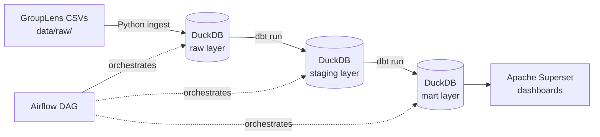

# Movie Recommendation Analytics Pipeline


End-to-end batch data pipeline using the public [GroupLens](https://grouplens.org/datasets/movielens/) movie recommendation dataset. Runs **100% locally** with open-source tools — no cloud account required.

---

## Architecture



| Layer | Tool | Role |
|---|---|---|
| Ingestion | Python + DuckDB | Load raw CSVs into local warehouse |
| Transformation | dbt Core | Staging, business logic, analytics marts |
| Orchestration | Apache Airflow | Schedule and monitor the full pipeline |
| Serving | Apache Superset | Interactive dashboards |
| CI/CD | GitHub Actions | `dbt test` + SQL lint on every push |

---

## Dataset

Source: [GroupLens Movie Recommendation Dataset](https://grouplens.org/datasets/movielens/)

| File | Description | Key columns |
|---|---|---|
| `movies.csv` | Movie catalog | `movieId`, `title`, `genres` |
| `ratings_for_additional_users.csv` | Explicit user ratings | `userId`, `movieId`, `rating`, `timestamp` |
| `user_rating_history.csv` | Historical ratings per user | `userId`, `movieId`, `rating`, `timestamp` |
| `user_recommendation_history.csv` | Recommendation events | `userId`, `movieId`, `timestamp` |
| `movie_elicitation_set.csv` | Preference elicitation movies | `movieId` |
| `belief_data.csv` | User onboarding preferences | `userId`, `movieId`, `belief` |

---

## Quick Start

**Prerequisites:** Python 3.11+, Docker + Docker Compose, dbt Core (`pip install dbt-duckdb`)

```bash
# 1. Clone and set up
git clone https://github.com/czelusniak/movie-analytics-pipeline.git
cd movie-analytics-pipeline
cp .env.example .env
pip install -r ingestion/requirements.txt

# 2. Download GroupLens CSVs to data/raw/ (see Dataset section above)

# 3. Run the full pipeline
make ingest        # Load CSVs → DuckDB raw layer
make dbt-run       # Transform: staging → intermediate → mart
make dbt-test      # Run all data quality tests

# 4. Start services
make airflow-up    # Airflow UI at http://localhost:8080
make superset-up   # Superset at http://localhost:8088
```

---

## Project Structure

```
movie-analytics-pipeline/
├── data/
│   ├── raw/                          # GroupLens CSVs (not committed)
│   ├── sample/                       # 100-row samples for testing
│   └── warehouse.duckdb              # Generated local warehouse (not committed)
├── ingestion/
│   ├── load_to_duckdb.py             # Loads CSVs into DuckDB raw layer
│   └── requirements.txt
├── dbt_project/
│   ├── dbt_project.yml
│   ├── profiles.yml
│   ├── models/
│   │   ├── staging/                  # Type cast, rename, deduplicate
│   │   ├── intermediate/             # Business logic, joins
│   │   └── marts/                    # Analytics-ready, Superset-facing
│   ├── tests/                        # Custom singular tests
│   └── seeds/                        # Reference data (genre mapping)
├── airflow/
│   ├── dags/movie_pipeline_dag.py    # Orchestration DAG
│   └── docker-compose-airflow.yml
├── docker/
│   └── docker-compose-superset.yml
├── .github/workflows/ci.yml          # CI: dbt test + sqlfluff
├── Makefile
└── README.md
```

---

## dbt Layers

```
raw.movies ─────────────────────┐
raw.ratings ────────────────────┤→ stg_* → int_* → mart_*
raw.user_rating_history ────────┘
```

| Layer | Models | Purpose |
|---|---|---|
| staging | `stg_movies`, `stg_ratings`, `stg_user_rating_history` | Type casting, renaming, deduplication |
| intermediate | `int_user_activity`, `int_genre_ratings` | Business logic and joins |
| marts | `mart_top_movies`, `mart_genre_stats`, `mart_ratings_over_time`, `mart_user_activity` | Analytics-ready, exposed to Superset |

---

## Dashboards (Superset)

| Dashboard | Business question answered |
|---|---|
| Top 10 Movies | Which movies have the highest avg rating with ≥50 ratings? |
| Most Rated | Which movies generate the most engagement? |
| Ratings Over Time | Are there seasonal patterns in user rating behavior? |
| Genre Popularity | Which genres have the most volume vs. best quality? |
| User Activity | What is the distribution of user engagement? |
| Popularity vs Quality | Is there a correlation between # ratings and avg score? |

---

## Data Quality

Tests implemented via dbt (`schema.yml`):

- `not_null` on all primary and foreign keys
- `unique` on `movieId` (movies), `ratingId` (ratings)
- `accepted_values` for `rating` column (0.5–5.0 scale)
- Custom test: no future timestamps in `rated_at`

```bash
make dbt-test
# All tests must pass before merging (enforced by CI)
```

---

## CI/CD

Every push to `main` or open pull request triggers:

1. `dbt test` against DuckDB with sample data
2. `sqlfluff lint` for SQL style consistency

See [.github/workflows/ci.yml](.github/workflows/ci.yml).

---

## What I Built and Learned

**Problems solved:**
- Multi-value `genres` field (pipe-separated) normalized into a flat structure via dbt
- Duplicate ratings across source files deduplicated using `ROW_NUMBER()` window function
- User activity metrics aggregated with proper handling of NULL and single-rating users

**Skills demonstrated:**
- Medallion architecture (raw → staging → intermediate → mart)
- dbt: `ref()`, `source()`, generic + singular tests, `schema.yml` as data contracts
- Airflow: DAG authoring, `BashOperator`, task dependencies and scheduling
- Docker Compose: multi-service local environment (Airflow + Superset)
- GitHub Actions: automated data quality gates on every PR

---

## Roadmap

- [ ] Add `dbt incremental` model for ratings (simulate streaming append)
- [ ] Publish dbt docs to GitHub Pages (lineage graph public)
- [ ] Add `dbt exposures` to document Superset as downstream consumer
- [ ] Add `sqlfluff` linting stage to CI
- [ ] Explore migration to Dagster for native dbt integration

---

## Stack

| Tool | Version | Role |
|---|---|---|
| Python | 3.11 | Ingestion scripting |
| DuckDB | 0.10+ | Local analytical warehouse (replaces BigQuery) |
| dbt Core | 1.8+ | SQL transformations + testing |
| Apache Airflow | 2.9+ | Pipeline orchestration |
| Apache Superset | 4.x | Dashboards and data exploration |
| Docker Compose | v2 | Local service orchestration |
| GitHub Actions | — | CI/CD |

---

## Inspiration

This project was inspired by [vbluuiza](https://github.com/vbluuiza)'s [Data Engineering tutorial](https://www.youtube.com/watch?v=38FhOVq3tI0) and adapted significantly: the original cloud stack (GCS + BigQuery + Metabase) was replaced with a fully local open-source stack (DuckDB + dbt Core + Airflow + Superset), and the data models were rewritten idiomatically with proper layering, tests, and best practices.

---

## Author

**George Czelusniak**
[LinkedIn](https://linkedin.com/in/george-czelusniak/) · [GitHub](https://github.com/czelusniak)

---

## License

Data sourced from [GroupLens Research](https://grouplens.org/) — used for educational and portfolio purposes only.
